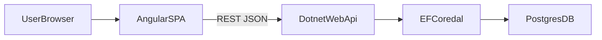

# Garden Planner MVP Implementation Plan

## Scope And Defaults

- Build a greenfield app in this repo (current repo has no backend/frontend code yet).
- Use a decoupled architecture by default: .NET API + Angular SPA + Postgres.
- MVP includes: garden boundary shape selection, plant placement, clickable species details, persistence.
- Exclude auth/collaboration/import-export for now.

## Proposed Architecture

## Backend (.NET 8 Web API)

- Create solution and API project:
  - [GardenPlanner.sln](GardenPlanner.sln)
  - [backend/GardenPlanner.Api/GardenPlanner.Api.csproj](backend/GardenPlanner.Api/GardenPlanner.Api.csproj)
  - [backend/GardenPlanner.Api/Program.cs](backend/GardenPlanner.Api/Program.cs)
- Add EF Core + Npgsql and implement persistence model:
  - [backend/GardenPlanner.Api/Data/GardenPlannerDbContext.cs](backend/GardenPlanner.Api/Data/GardenPlannerDbContext.cs)
  - [backend/GardenPlanner.Api/Models/GardenPlan.cs](backend/GardenPlanner.Api/Models/GardenPlan.cs)
  - [backend/GardenPlanner.Api/Models/PlantPlacement.cs](backend/GardenPlanner.Api/Models/PlantPlacement.cs)
  - [backend/GardenPlanner.Api/Models/Species.cs](backend/GardenPlanner.Api/Models/Species.cs)
- Add first migration and connection config:
  - [backend/GardenPlanner.Api/appsettings.json](backend/GardenPlanner.Api/appsettings.json)
  - [backend/GardenPlanner.Api/appsettings.Development.json](backend/GardenPlanner.Api/appsettings.Development.json)
- Implement API endpoints:
  - [backend/GardenPlanner.Api/Controllers/GardenPlansController.cs](backend/GardenPlanner.Api/Controllers/GardenPlansController.cs)
  - [backend/GardenPlanner.Api/Controllers/SpeciesController.cs](backend/GardenPlanner.Api/Controllers/SpeciesController.cs)
  - CRUD for garden plans and plant placements; read endpoints for species catalog/details.
- Seed initial species data for clickable info cards.

## Frontend (Angular)

- Scaffold Angular app:
  - [frontend/angular.json](frontend/angular.json)
  - [frontend/package.json](frontend/package.json)
  - [frontend/src/main.ts](frontend/src/main.ts)
- Build core planning UI:
  - [frontend/src/app/pages/planner/planner.component.ts](frontend/src/app/pages/planner/planner.component.ts)
  - [frontend/src/app/components/garden-canvas/garden-canvas.component.ts](frontend/src/app/components/garden-canvas/garden-canvas.component.ts)
  - [frontend/src/app/components/species-panel/species-panel.component.ts](frontend/src/app/components/species-panel/species-panel.component.ts)
- Interaction model:
  - Shape picker (rectangle/circle/polygon-lite) to define boundary.
  - Click-to-place plants with species selection.
  - Select placed plant to open species detail panel.
- Add API client services:
  - [frontend/src/app/services/garden-api.service.ts](frontend/src/app/services/garden-api.service.ts)
  - [frontend/src/app/services/species-api.service.ts](frontend/src/app/services/species-api.service.ts)

## Local Dev And Infrastructure

- Add Docker Compose for Postgres only (app processes run locally):
  - [docker-compose.yml](docker-compose.yml)
- Add root docs/scripts:
  - [README.md](README.md)
  - Include commands for DB startup, API run, Angular run, and migration workflow.

## MVP Data/Contract Baseline

- `GardenPlan`: `id`, `name`, `boundaryType`, `boundaryData`, `createdAt`, `updatedAt`.
- `PlantPlacement`: `id`, `gardenPlanId`, `speciesId`, `x`, `y`, `labelOverride?`.
- `Species`: `id`, `commonName`, `scientificName`, `sunNeeds`, `spacingCm`, `notes`.
- `boundaryData` stored as JSON to support multiple shape types with one schema.

## Verification

- Backend: basic integration tests for garden CRUD and species lookup.
- Frontend: component/service tests for placement interactions and API integration boundaries.
- Manual smoke test: create plan, set shape, place plants, click plant for species info, reload and confirm persistence.

## Execution Order

1. Scaffold backend + DB + initial migration.
2. Implement API contracts and seed species.
3. Scaffold frontend and planner canvas interactions.
4. Connect Angular services to API and persist/load data.
5. Add tests and finalize README runbook.
